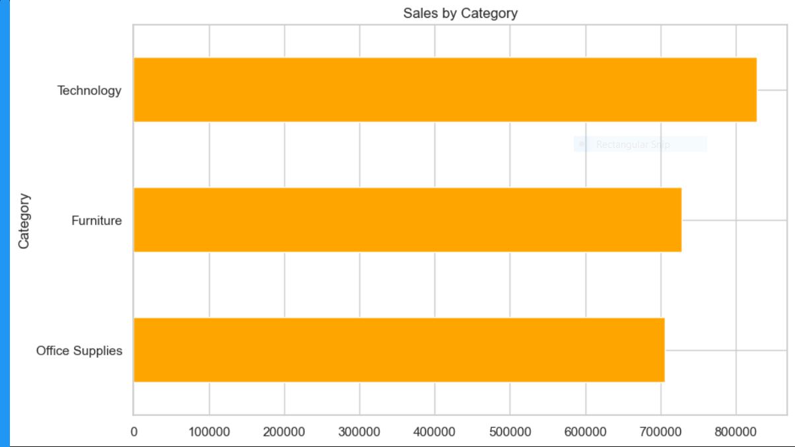
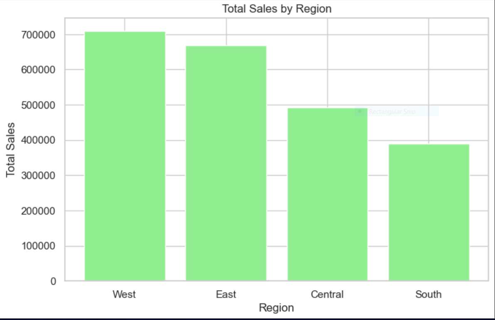
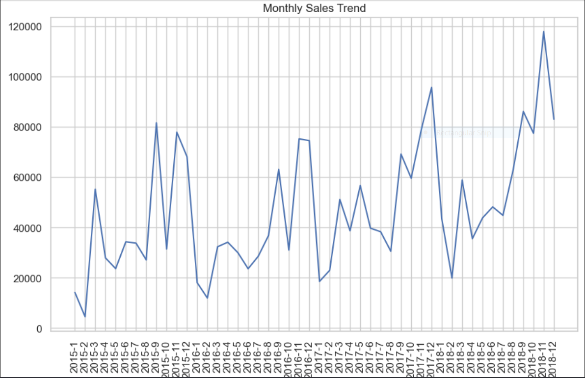
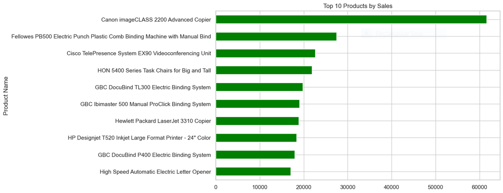

# 🛒 Supermarket Sales Analysis

---

## 📌 Project Overview

This project analyzes a supermarket sales dataset (`supermarket.csv`) to extract actionable business insights. Using **Python**, **Pandas**, and visualization libraries, the analysis explores revenue trends, product performance, regional and segment-level sales, and customer behavior.

📊 The findings support strategic decisions in **sales**, **marketing**, and **inventory management**.

---

## 🎯 Objectives

* 📈 Analyze total and average sales across **categories**, **sub-categories**, **regions**, and **customer segments**
* 🏆 Identify **top-performing products** and **high-value customers**
* 📅 Assess **sales trends over time** (yearly and monthly)
* 🌍 Highlight **regional and state-level performance**
* 💡 Provide **actionable recommendations** to boost revenue

---

## 📂 Dataset

The dataset `supermarket.csv` includes:

* 🧾 **Order Details:** `Order ID`, `Order Date`, `Ship Date`, `Ship Mode`
* 👤 **Customer Info:** `Customer ID`, `Customer Name`, `Segment`
* 📍 **Location:** `Country`, `City`, `State`, `Postal Code`, `Region`
* 📦 **Product Info:** `Product ID`, `Category`, `Sub-Category`, `Product Name`
* 💰 **Sales:** `Sales`

⚠️ *Missing values in `Postal Code` were imputed using the mode.*

---

## 📊 Key Insights

### 💰 Overall Sales

* **Total Sales:** $2,261,536.78
* **Average Sales per Order:** $230.77
* **Maximum Sale:** $22,638.48
* **Minimum Sale:** $0.44

---

### 🗂️ Category-Level Sales

| Category           | Total Sales | Avg Sale per Order | Orders |
| ------------------ | ----------- | ------------------ | ------ |
| 💻 Technology      | $827,456    | $456.40            | 1,813  |
| 🪑 Furniture       | $728,659    | $350.65            | 2,078  |
| 🧾 Office Supplies | $705,422    | $119.38            | 5,909  |

---

### 🥇 Top Sub-Categories

* 📱 Phones: $327,782
* 🪑 Chairs: $322,823
* 📦 Storage: $219,343

---

### 🌍 Regional Performance

| Region     | Total Sales | Avg Sale | Orders |
| ---------- | ----------- | -------- | ------ |
| 🌄 West    | $710,220    | $226.18  | 3,140  |
| 🏙️ East   | $669,519    | $240.40  | 2,785  |
| 🌾 Central | $492,647    | $216.36  | 2,277  |
| 🌴 South   | $389,151    | $243.52  | 1,598  |

---

### 👥 Segment Performance

| Segment        | Total Sales | Avg Sale | Orders |
| -------------- | ----------- | -------- | ------ |
| 🧑 Consumer    | $1,148,061  | $225.07  | 5,101  |
| 🏢 Corporate   | $688,494    | $233.15  | 2,953  |
| 🏠 Home Office | $424,982    | $243.40  | 1,746  |

---

### ⭐ Top Customers

1. 🥇 Sean Miller — $25,043
2. 🥈 Tamara Chand — $19,052
3. 🥉 Raymond Buch — $15,117

---

### 🗺️ State-Level Sales

* 🌴 California: $446,306
* 🗽 New York: $306,361
* 🤠 Texas: $168,573

---

### 📅 Yearly Sales

| Year | Sales    |
| ---- | -------- |
| 2015 | $479,856 |
| 2016 | $459,436 |
| 2017 | $600,193 |
| 2018 | $722,052 |

---

### 📆 Monthly Sales

* 🔥 **Peak Months:** November ($350,162), December ($321,480)
* ❄️ **Lowest Months:** February ($59,371), January ($94,292)

---

### 🏆 Top Products

1. 🖨️ Canon imageCLASS 2200 Advanced Copier — $61,600
2. 📎 Fellowes PB500 Binding Machine — $27,453
3. 📡 Cisco TelePresence System EX90 — $22,638

---

## 📸 Visualizations

### 📊 Sales by Category


### 🌍 Regional Sales Distribution


### 📈 Monthly Sales Trend


### 🏆 Top Products


---


## ⚙️ Setup Instructions

### 🧰 Prerequisites

* 🐍 Python 3.x
* 📓 Jupyter Notebook
* 📚 Libraries: `pandas`, `numpy`, `matplotlib`, `seaborn`

---

### 🚀 Installation

1️⃣ Clone the repository:

```bash
git clone https://github.com/yourusername/supermarket-sales-analysis.git
cd supermarket-sales-analysis
```

2️⃣ Install dependencies:

```bash
pip install pandas numpy matplotlib seaborn jupyter
```

3️⃣ Open the notebook:

```bash
jupyter notebook notebooks/supermarket.ipynb
```

4️⃣ Load dataset:

* Place `supermarket.csv` inside the `data/` folder
* Run all cells to reproduce analysis

---

## 📁 File Structure

```text
supermarket-sales-analysis/
│
├── 📓 notebooks/              # Jupyter notebooks for analysis
│   └── supermarket.ipynb
│
├── 📂 data/                   # Dataset files
│   └── supermarket.csv
│
├── 📄 README.md               # Project overview and instructions
└── 📦 requirements.txt        # Python dependencies
```

---

## 🚀 Future Improvements

* 📊 Add interactive dashboards (Power BI / Tableau)
* 🤖 Apply machine learning for sales forecasting
* 🌐 Deploy as a web dashboard

---

## ⭐ If you like this project

Give it a ⭐ on GitHub and feel free to contribute!
